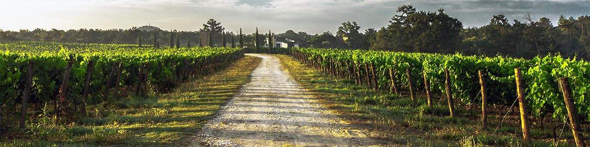

# <b> Partners In Wine <b>

  

Final Project

## Purpose
The purpose of this project is to determine how weather impacts the scores of wine.

 ***Link to web app: [Web App](https://groupfive-wine.herokuapp.com/)***
 
   ***Link to rough draft of our presentation on google slides:[Wine Quality Machine Leanring](https://docs.google.com/presentation/d/1-MctTWS8TrRcArjXzD5Xvzrx4bVrTv7aOP1SWWkiZ2g/edit?usp=sharing)***

***Link to our Tableau dashboard: [Wine Quality Dashboard](https://public.tableau.com/profile/valencia.loyd2616#!/vizhome/Group_5_wine_16046307141490/PartnersinWine?publish=yes)***

***Link to the repository[Web App Repository](https://github.com/soijebor/groupfive-wine#groupfive-wine)***

  

# First Segment
My role in this project was to research data on weather and and global wine scores, import the data using APIs, merge the data, and clean the data.  NOAA and the Global Wine Score websites are terrific resources for finding weather and wine data. 

## Data Cleaning
This step involved importing APIs to call weather, wine and soil data. The data was collected from Global Wine Scores, NOAA, and the USGS website. It was then cleaned and finally merged together. Data was split between white wine and red wine before the weather and soil data was merged with it. The Global Wine Scores website has data for wines, the regions that they were grown in, and the scores associated with each wine. These vintages range from 1992 to 2016 and have an average score of approximately 91%. 
 The wine data takes different wines and scores going back to 1992.

Some of the challenges for finding the best weather data was to find zip codes that have reliable temperature and precipitation data. Most of the zip codes had data that originated before 1992 but the stations had missig dates for temperature, precipitation, or both of the values. The process for finding optimal stations involved an iterative process of importing different zip codes for temperature data and different zip codes for precipitation data to determine which zip codes have the best coverage of data. Another challenge to merging weather and wine data was that several appellations (regions) within a state straddled two different zip codes. One of the assumptions this study has made was that weather data would be the same for zip codes that were within 50 mile radius of one another. This allowed the group to assign zip codes for certain appellations and allowed the data to be merged together more succinctly. The wine data comes from wine that is concentrated in Washington State, Oregon, Napa Valley California, Sonoma County California, and the Santa Cruz Mountains in California as well. There were some appellations that only have one or two data points that were dropped from the study.

### Importing NOAA Data
NOAA has excellent documentation on their API that allowed us to pull maximum and minimum temperatures as well as precipitation. One challenges of this API is that there are different stations within a zip code that might have data on temperature but not on precipitation. One station might have maximum and minimum temperatures but not precipitation. Another station might have precipitation but only 80% of temperature data. I broke the code up into different stations for each For Loop in order to find the best stations with the least amount of NAN values. I also broke the code up into temperature and precipitation to identify stations within the same zip codes that had good data for the regions we were interested in.

### Importing Wine Data
The Global Wine Score website allowed us to search by country and color. We chose to focus on the US due to reliable and abundant weather data. 

### Merging The Data
Once the weather and wine data was imported using the APIs, we identified the weather data that had large errors and went back and checked more weather stations. Once we were satisfied with the data we had, we merged weather and wine data. We combined the weather and wine data using the appellations (areas where the wine was grown). Finally we cleaned the data by dropping NAN values and columns that were not needed.

# Second Segment
My role in this part of the project was to create the HTML and then work on getting the Flask App to access the machine learning model to work with the HTML

## HTML
I imported photos, found a good template online, and then went to work cleaning up the template and importing the photos to the HTML. An example of the HTML can be found under the folder HTML. Some of the challenges in creating the index.html file included fixing the plug-ins to display the right data and correcting the JavaScipt to fit our needs.

## Flask App
I worked with the group to develop the flask app to display the HTML and to use the model to determine whether a wine was of "High Quality" or "Low Quality". The flask app uses a static folder to hold all of the images, JavaScript, css, and other files to work with the HTML to produce the app. The templates file holds the HTML, and the app.py file works with the red and white scalar files to produce the app and work with the model.
